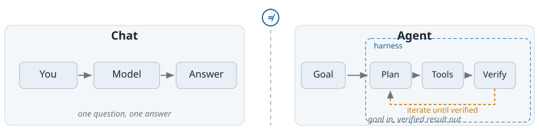
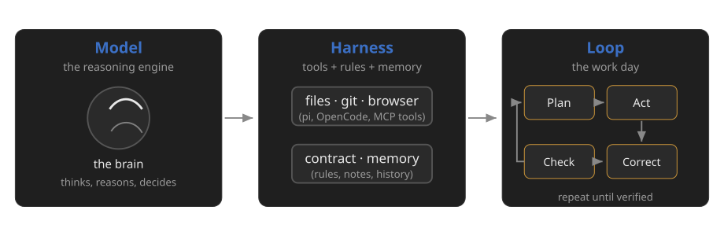
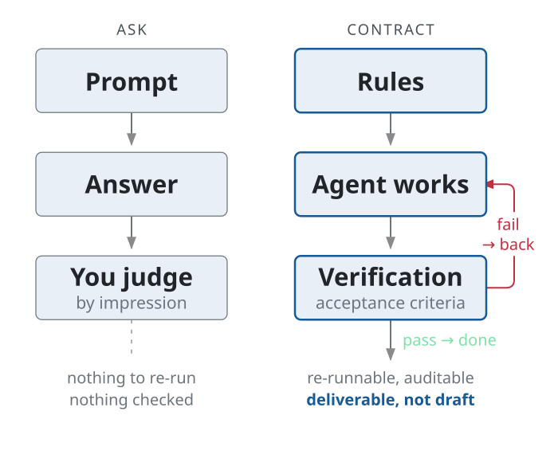
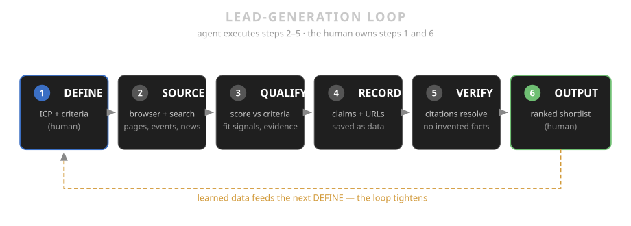

<!-- _class: lead -->

# Agentic AI for Lead Generation

## Partnership Companies for the Marketing Chair

Tobias Weiß · Guest Lecture · Marketing Chair

45 minutes · BWL Master students

<!-- notes:
(1 min) Welcome. What this lecture is: what agentic AI is, and how
to operate it through a harness. Everything we do maps to one real
task: helping the chair find and qualify B2B partner companies.
The output of this session is the input for the Bachelor seminar.
-->

---

## Why this session exists

- The chair partners with companies: funding, data, cases
- Finding + qualifying partners is manual, slow, unscalable
- Agentic AI can research, score and rank prospects
- **Your output = input for the Bachelor seminar**

> Nobody wins from another lecture about chatbots.

<!-- notes:
(1 min) Concrete goal for the students: by the end you can RECOGNISE
and judge an agentic workflow — and read the contract that drives it.
The artefact shown in the walkthrough (a ranked lead list with sources)
becomes the working dataset the Bachelor students build on.
-->

---

## What you will be able to do

| By the end… | You can… |
|---|---|
| **Understand** | Explain what "agentic" means, and why it is not a chatbot |
| **Operate** | Read how a harness (pi) gives an AI tools, rules and a task |
| **Assess** | Judge an agentic output: checked? citable? repeatable? |
| **Apply** | Use the demoed loop (contract → run → verify) for partner sourcing |

> Model = brain. Harness = hands. Workflow = muscles.

<!-- notes:
(30 s) Read the rows top to bottom; each becomes a section of the
lecture. Row 4 notes there is no hands-on today — the walkthrough
models the method; trying it yourself is the exercise afterwards.
-->

---

<!-- _class: smaller -->

## Roadmap — 45 minutes

| Block | Content | Time |
|---|---|---|
| 1 · Foundations | agentic ≠ chat · model · harness · loop | ~12 min |
| 2 · Method | contracts · the lead-gen loop · evidence | ~8 min |
| 3 · Walkthrough | live demo: contract → agent → verify | ~15 min |
| 4 · Reflection | providers · take-aways · resources · Q&A | ~10 min |

> The walkthrough is the heart — theory is fuel for it.

<!-- notes:
(15 s) Show the arc; the walkthrough (block 3) is where the method
becomes visible. Q&A stays flexible at the end.
-->

---

## Agentic ≠ chat



> "Agentic" is a working environment — not a better chat.

<!-- notes:
(3 min) Left: chat — question in, answer out, no tools, no files.
Right: agent — a goal, a plan, tools, verification, inside a harness
that grants access. The amber loop is where the work happens.
The students' common misconception: "agentic = a smarter ChatGPT".
Set it straight here: it is a difference in kind — the model can
touch the world (browser, files, APIs) and check its own work.
-->

---

## The parts: model · harness · loop



**Harnesses (2026):** pi, OpenCode, open-source ecosystems — same models, different results, depending on the harness.

<!-- notes:
(3 min) Keep it simple. The model is the part students already know.
The harness is the missing piece this lecture adds: an executable
environment (terminal, browser, files) + permissions + memory.
The loop is what makes it "agentic": it iterates, checks, corrects.
-->

---

<!-- _class: smaller -->

## Why now — the evidence inside the research corpus

13,096 marketing papers · 7,771 published in 2026 alone

| Signal | Count |
|---|---|
| Papers mentioning **agentic AI** | 91 |
| Papers on **lead generation** | 27 |
| **Both** (agentic × lead-gen) | 5 |

> The field is exploding — and the marketing**chair** can be at the front.

<!-- notes:
(2 min) Ground the hype in data from the chair's own open research
corpus (marketing-research, public on GitHub). Agentic papers exist,
lead-gen papers exist, but nearly nobody connects both yet. This is
a research gap AND a practical opportunity. Number on screen: 2026
alone produced 7,771 of the 13,096 papers.
-->

---

## How to talk to the machine: prompts vs contracts



> Prompt = how you ask a chat · Contract = how you run an agent.

<!-- notes:
(2 min) The central mental model of the lecture: prompts are how you
ask a chat; contracts are how you run an agent. A contract lives in
the repo, is versioned, and says what done means. This is what turns
an AI "idea generator" into a reproducible research pipeline.
-->

---

## A lead-generation loop as an agentic workflow



> Six steps — the agent executes 2–5, you own definition and evaluation.

<!-- notes:
(3 min) Walk the diagram left to right: DEFINE (human, blue) → SOURCE
→ QUALIFY → RECORD → VERIFY → OUTPUT (human, green). The agent runs
the middle four; the human sets criteria and judges the result. The
amber feedback line: learned data tightens the next iteration's
criteria. This exact pipeline is what the walkthrough demonstrates
live in the next block.
-->

<!-- fallback: keep the step text for PDF/print contexts if the SVG
is unavailable.
1  DEFINE   → ICP for the chair's partner programme
2  SOURCE   → browser + search: prospects, events, funding
3  QUALIFY  → score company vs ICP (fit signals, evidence)
4  RECORD   → every claim with a URL, save as data
5  VERIFY   → citations resolve, no invented facts
6  OUTPUT   → ranked shortlist → Bachelor seminar input
-->

---

## Now: a live walkthrough

Task: build the **partner-candidate shortlist** (top 10 B2B companies) with:

- Fit signal per company vs. the chair's partnership goals
- Named source URL per claim (citable, verifiable)
- Ranked output — your input for the Bachelor seminar

I run this live in a harness — what you see is what the agents do.

<!-- notes:
(30 s) Frame the demo: no hands-on today, a walkthrough instead. The
task is the same one the Bachelor seminar will pick up. We watch the
harness do steps 2-5 live; I narrate what happens and why.
-->

---

<!-- _class: smaller -->

## Walkthrough · Step 1 — The contract

```text
AGENTS.md / brief (what the agent reads at start)
Goal:      shortlist of 10 B2B partner candidates for the chair
Criteria:  industry fit, innovation agenda, university links
Sources:   company sites, press, funding registries
Output:    ranked list, every claim with a URL
Rules:     no invented facts; if unsure, mark as unverified
```

> Done means: verified, cited, repeatable.

<!-- notes:
(2 min) Show the contract as the first artifact. The students see that
"prompting" an agent starts with writing rules, not typing a question.
This slide is the live file on screen.
-->

---

<!-- _class: smaller -->

## Walkthrough · Step 2 — The agent at work

Watch the six-step loop run live:

- **only watch** — no magic, every tick is visible in the terminal
- agent **opens the browser** (MCP), reads real company pages
- scores against **the contract** → markdown table with **URLs**
- **iterates**: pause, correct, re-check — that is the loop

> The plan lives on screen. Done means: verified, cited, repeatable.

<!-- notes:
(6-8 min) THE core demo. Run the analysis loop live in pi. Narrate:
(1) it opens the browser via MCP/BrowserMCP, searches for prospect
companies; (2) it reads real pages and extracts fit signals; (3) it
scores against the contract; (4) it writes a markdown table with URLs;
(5) it re-checks its own citations; (6) it produces the ranked list.
The visual loop is on the pipeline slide before — reference it so
students map what they see to the six boxes. Strategy: use a small
real example (2-3 companies, one industry) — speed beats completeness.
Show a mistake on purpose if possible: pause, let the agent correct —
that IS the "loop".
-->

---

## Walkthrough · Step 3 — The three questions

1. **Checked?** Did the agent verify its output, not just generate it?
2. **Citable?** Does every claim have a URL that resolves?
3. **Repeatable?** Re-run the same contract → same result?

> The final slide of the walkthrough: apply them to the live result.

<!-- notes:
(2 min) Apply the three-question bar to the just-seen output. If it
passes, it is a deliverable; if not, it is a draft. This turns the
demo result into the artefact the Bachelor seminar receives.
-->

---

<!-- _class: lead -->

## What you just saw

1. A contract (rules) — not a prompt
2. An agent doing the loop: plan → act → check → correct
3. A verifiable artefact — the ranked shortlist

**That is the method** — reusable for any partner-sourcing task.

<!-- notes:
(1 min) Close the walkthrough: the students take away the METHOD, not
just the result. The contract + three questions are the transferable
part; the harness is a tool they can try themselves afterwards.
Point to resources slide for how to start.
-->

---

## What the chair gets out of it

- A reproducible partner-sourcing method (not a one-off search)
- A ranked, sourced shortlist — usable immediately
- Students who can run agentic workflows (a real skill for the CV)
- Input data for the **Bachelor seminar** — thematically linked

> The lecture is not the output. The shortlist is.

<!-- notes:
(2 min) Make the value exchange explicit — why the chair invested in
this guest lecture. Also honest note: the method is open and reusable;
students may embed it in internships and theses.
-->

---

<!-- _class: smaller -->

## Key AI providers — what you can use as a student

| Provider / offer | What you get | Where |
|---|---|---|
| **JLU HRZ API-Service** ⭐ | LLMs for all JLU members: free local Qwen models (256K–1M ctx) + commercial, works with OpenCode / Claude Code | [uni-giessen.de HRZ API-Service](https://www.uni-giessen.de/de/fbz/svc/hrz/svc/services/ki/api-service) · access via **ki@uni-giessen.de** |
| **Google AI student plan** | 1 year Google AI **Plus** free · Gemini, higher limits, 400 GB | [one.google.com/ai-student](https://one.google.com/ai-student?g1_landing_page=75) — verify with university email |
| **OpenRouter** | one API key → many models (OpenAI, Anthropic, Google, open) · free models + pay-as-you-go | [openrouter.ai](https://openrouter.ai) |
| **Harnesses** | the tools from today's demo — **OpenCode**, pi (any API key above, incl. HRZ) | [opencode.ai](https://opencode.ai) · [pi.dev](https://pi.dev) |
| **Local models (Ollama)** | free, run on your own laptop, no account, private | [ollama.com](https://ollama.com) |

> Start with **HRZ API**: free for JLU members · Google deal expires **Dec 31, 2026**.

<!-- notes:
(2 min) Practical slide — what students can use NOW. Lead with the
JLU HRZ API-Service: LLM endpoints for all JLU members, open-source
(qwen3-coder-next 256K, qwen3.8-27b 1M) and commercial models; access
by emailing ki@uni-giessen.de; configured in OpenCode via LiteLLM
provider block (baseURL api.hrz.uni-giessen.de) or Claude Code via
ANTHROPIC_BASE_URL. Google row: 12-month free Google AI Plus for
eligible students, verify via SheerID, redeem by Dec 31 2026.
OpenRouter: one key for many vendors, free models and pay-as-you-go
(no subscription) — good if they want a specific commercial model
without per-vendor signups. Ollama = local + free + private.
Harnesses: OpenCode (first-class with HRZ API + OpenRouter) and pi are
what the walkthrough just used.
-->

---

## Take-aways

1. Agentic = working environment, not a chatbot
2. Harness = model + tools + rules = accountable AI work
3. Contract first: define "done" before you start
4. Verify, cite, repeat — the three questions

> Next week: your shortlist becomes the Bachelor seminar's input.

<!-- notes:
(1 min) Recap the four take-aways. Close the loop: the artefact —
the ranked shortlist — is the handover point to the Bachelor
seminar. That is the "output as input" promise from the title slide.
-->

---

## Resources

- **JLU HRZ API-Service** (free LLMs for JLU members) — [uni-giessen.de → HRZ → KI → API-Service](https://www.uni-giessen.de/de/fbz/svc/hrz/svc/services/ki/api-service) · [model overview](https://api.hrz.uni-giessen.de/ui/model_hub_table/)
- **pi** — [pi.dev](https://pi.dev) · docs: [pi.dev/docs](https://pi.dev/docs) · **OpenCode** — [opencode.ai](https://opencode.ai) · **OpenRouter** (one key, many models) — [openrouter.ai](https://openrouter.ai)
- **Google AI student plan** — [one.google.com/ai-student](https://one.google.com/ai-student?g1_landing_page=75) (1 year free for students)
- **marketing-research** (chair corpus, public) — [github.com/tobias-weiss-ai-xr/marketing-research](https://github.com/tobias-weiss-ai-xr/marketing-research)
- **skeleton-research** (forkable corpus skeleton) — [github.com/tobias-weiss-ai-xr/skeleton-research](https://github.com/tobias-weiss-ai-xr/skeleton-research)
- **This deck** — in this workshop repo (English, 45 min)

<!-- notes:
(30 s) Do not read aloud; everything here is public and re-usable.
Lead with HRZ API-Service — it is the free, university-provided LLM
access for students (request a key via ki@uni-giessen.de; OpenCode
works with a LiteLLM provider pointing at api.hrz.uni-giessen.de).
The Google link repeats the providers slide's key offer so it
survives on its own (e.g. when the slide is shared). The
marketing-research corpus is the evidence base for the "why now"
slides; skeleton-research is what a student can fork to run their own
curated corpus.
-->

---

<!-- _class: lead -->

# Thank you!

## Questions?

Tobias Weiß · guest lecture · Marketing Chair

Agentic AI for Lead Generation · 45 min

<!-- notes:
(5-10 min) Q&A + apply the three questions to the walkthrough result.
Likely questions: model choice (harness is model-agnostic; pi switches
model with Ctrl+L), costs (cheap models + tight contracts), data
privacy (local models), what "qualified" means (the contract), and how
to try it themselves (resources slide).
-->
